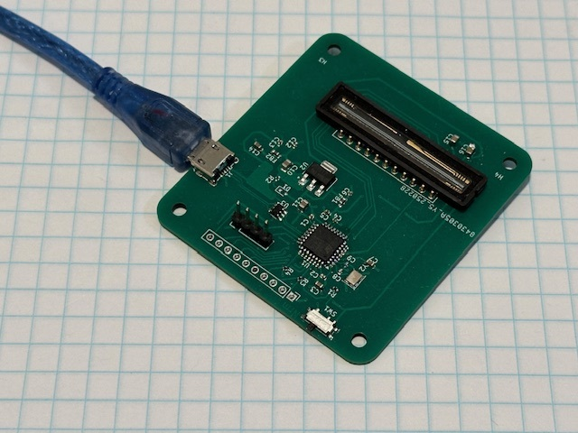

# STM32 TCD1304 Readout Firmware (VCP + HID)

This repository contains firmware and Python tools for reading data from a **TCD1304 linear CCD sensor** using a custom STM32-based board. The system supports **two USB communication protocols**:
- **VCP (Virtual COM Port)**
- **HID (Human Interface Device)**

Both firmware variants are implemented in C using STM32 HAL libraries. Example Python scripts are provided to demonstrate data acquisition on the host side.

---

## Overview

The custom board drives a TCD1304 CCD sensor and reads analog data via ADC + DMA. It supports USB communication to a host PC, where the sensor data can be visualized or processed.

- **Sensor**: TCD1304 (3648 pixels)
- **MCU**: STM32G4
- **ADC Readout**: DMA-enabled 12-bit ADC
- **Trigger/Control**: Multiple timers and PWM outputs for CCD clocks
- **USB Transfer**: Either CDC (VCP) or HID class
- **Host-side Scripts**: Python examples for both modes

---

## Repository Structure

firmware/VCP/ # STM32 firmware using USB CDC (Virtual COM Port)

firmware/HID/ # STM32 firmware using USB HID protocol

host/VCP/tdcserial.py  # Python script for VCP communication

host/HID/tdchid.py # Python script for HID communication
